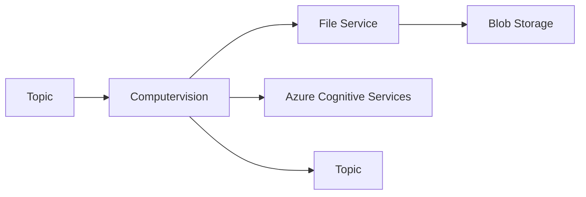

# Computervision
The *Computervision* service is responsible for processing the images and analyses the content.

## Process


## Debugging
The service can be easily debugged locallly.

**Requirements:**
- Dapr installed locally
- File Service running locally
- Azure Cognitive Services

In the _secrets.json_ set the _CognitiveServicesKey_ to the key of your Azure Cognitive Services account.
In the _secretstore.yaml_ replace the path to the _secrets.json_ file.
In the _lauchSettings.json_ set the COGNITIVE_SERVICE_URL_ to the url of your Azure Cognitive Services account.

Since the service utilizes _Man.Dapr.Sidekick.AspNetCore_ the application can be debugged locally by starting the application in debug mode.

## Deployment
To create a docker image for the service navigate to the _Computervision_ folder and run the following command:

```bash
$ docker build --platform amd64 -t computervision .
```

## Push Image to Container Registry
To push the image to the container registry run the following command:

```bash
 $ az acr login --name <container registry>
 $ docker tag computervision <container registry>/computervision
 $ docker push <container registry>/computervision
```

## Deploy to Azure Container Apps
Deploy the _Computervision_ service to azure container app.

```bash
ENDPOINT=$(az cognitiveservices account show -n <computer vision> -g <resource group> --query properties.endpoint --output tsv)
```

```bash
az containerapp create \
  --name computervision \
  --resource-group <resource group> \
  --environment <container app environment> \
  --image <container registry>/computervision:latest \
  --target-port 80 \
  --ingress 'internal' \
  --min-replicas 1 \
  --max-replicas 1 \
  --enable-dapr \
  --dapr-app-id computervision \
  --dapr-app-port 80 \
  --registry-server <container registry> \
  --env-vars 'COGNITIVE_SERVICE_URL'=$ENDPOINT \
  --user-assigned <managed identity>
```