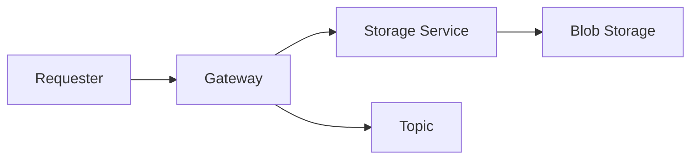

# Gateway

The *Gateway* service is the entry point for all requests to the system.
It is responsible for offloading the request body via the *Storage* service to the *BlobStorage* and then publishes a message to an Azure ServiceBus topic.

## Process


## Debugging
The service can be easily debugged locally.

**Requirements:**
- Dapr installed locally
- File Service running locally

Since the service utilizes _Man.Dapr.Sidekick.AspNetCore_ the appication can be debugged locally by starting the application in debug mode.

An exmaple request can be found in the _requests_ folder.

## Deployment

### Create Docker Image
To create a docker image for the service navigate to the _Gateway_ folder and run the following command:

```bash
 $ docker build -t gateway  .
```
