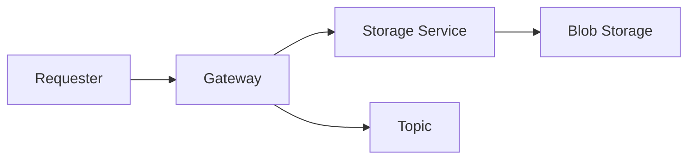

# Gateway

The *Gateway* service is the entry point for all requests to the system.
It is responsible for offloading the request body via the *Storage* service to the *BlobStorage* and then publishes a message to an Azure ServiceBus topic.

## Process


## Debugging
The service can be easily debugged locally.

**Requirements:**
- Dapr installed locally
- File Service running locally

Since the service utilizes _Man.Dapr.Sidekick.AspNetCore_ the appication can be debugged locally by starting the application in debug mode.

An example request can be found in the _requests_ folder.

## Deployment

### Create Docker Image
To create a docker image for the service navigate to the _Gateway_ folder and run the following command:

```bash
 $ docker build --platform amd64 -t gateway  .
```

## Push Image to Container Registry
To push the image to the container registry run the following command:

```bash
 $ az acr login --name <container registry>
 $ docker tag gateway <container registry>/gateway
 $ docker push <container registry>/gateway
```

## Deploy to Azure Container Apps
Deploy the _Gateway_ service to the azure container app.

```bash
az containerapp create \
  --name gateway \
  --resource-group <resource group> \
  --environment <container app environment> \
  --image <container registry>/gateway:latest \
  --target-port 80 \
  --ingress 'external' \
  --min-replicas 1 \
  --max-replicas 1 \
  --enable-dapr \
  --dapr-app-id gateway \
  --dapr-app-port 80 \
  --registry-server <container registry> \
  --user-assigned <managed identity>
```