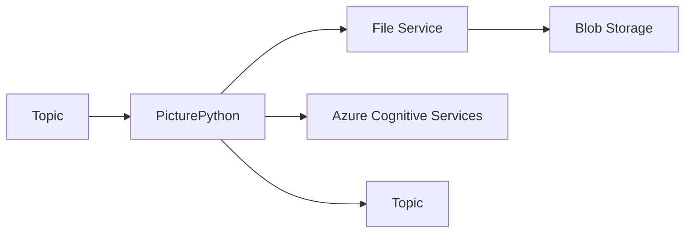

# Picture Python

Python implementation of the _Computervision_ service.

## Overview
The *PicturePython* service is responsible for processing images and analyzing their content using Azure Cognitive Services. This is a Python implementation that mirrors the functionality of the C# Computervision service.

## Process


## Dependencies
This project uses `uv` for dependency management. Dependencies are defined in `pyproject.toml`.

## Requirements
- Python 3.11+
- Dapr installed locally
- File Service running locally
- Azure Cognitive Services account

## Environment Variables
- `COGNITIVE_SERVICE_URL`: URL of your Azure Cognitive Services endpoint

## Secrets
The service expects the following secret to be available via Dapr secret store:
- `cognitive-service-key`: Azure Cognitive Services API key

## Building

### Local Development
Install dependencies using uv:
```bash
uv pip install -e .
```

Run the service:
```bash
python main.py
```

### Docker Build
To create a docker image for the service:

```bash
docker build --platform amd64 -t picturepython .
```

## Deployment
Similar to the Computervision service, this can be deployed to Azure Container Apps:

```bash
ENDPOINT=$(az cognitiveservices account show -n <computer vision> -g <resource group> --query properties.endpoint --output tsv)

az containerapp create \
  --name picturepython \
  --resource-group <resource group> \
  --environment <container app environment> \
  --image <container registry>/picturepython:latest \
  --target-port 50051 \
  --ingress 'internal' \
  --min-replicas 1 \
  --max-replicas 1 \
  --enable-dapr \
  --dapr-app-id picturepython \
  --dapr-app-port 50051 \
  --dapr-app-protocol grpc \
  --registry-server <container registry> \
  --env-vars 'COGNITIVE_SERVICE_URL'=$ENDPOINT \
  --user-assigned <managed identity>
```
